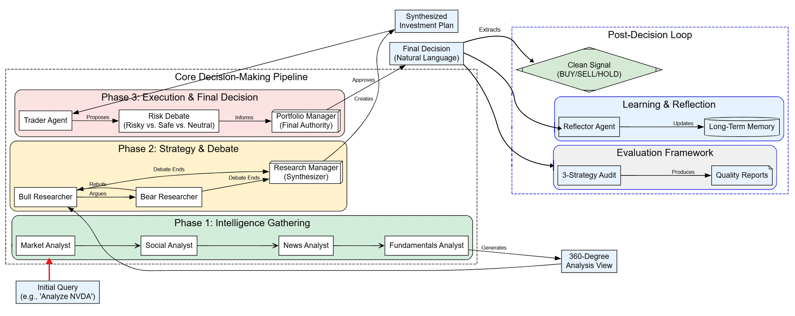

# 深度思考多智能体交易系统
[深度思考交易系统](https://zhuanlan.zhihu.com/p/1984268898992943950)包含多个部门，每个部门都由若干子智能体组成，
这些子智能体运用逻辑流程做出智能决策。例如，分析师团队从各种来源收集数据，
研究员团队讨论并分析这些数据以制定策略，
而执行团队则与投资组合管理、其他辅助子智能体等协同工作，
最终完善并批准交易。

可先阅读知乎文章[构建基于多智能体架构的深度思考交易系统(分析师、辩论、交易员、风险、评估)](https://zhuanlan.zhihu.com/p/1984268898992943950)

其背后运作机制复杂，典型的流程如下……



1. 首先，一支专业的分析师团队收集360度全方位市场情报，涵盖从技术数据、新闻到社交媒体情绪和公司基本面等所有信息。
2. 然后，多头和空头分析师进行对抗性辩论，以检验研究结果，研究经理将辩论结果综合成一个平衡的投资策略。
3. 接下来，交易员智能体将此策略转化为具体可行的方案，该方案将立即由多视角风险管理团队（风险型、安全型和中性型）进行审查。
4. 最终的、具有约束力的决策由投资组合经理智能体做出，该智能体会权衡交易员的方案与风险评估，并做出最终批准。
5. 获得批准后，系统会从经理的自然语言决策中提取清晰的、机器可读的信号（买入、卖出或持有），用于执行和审计。
6. 最后，整个过程形成一个反馈循环。智能体会反思交易结果，总结新的经验教训，并将这些经验教训存储在长期记忆中，以持续改进未来的业绩。

> 在本博客中，我们将编写代码并可视化一个先进的基于智能体的交易系统，分析师、研究员、交易员、风险经理和投资组合经理将协同工作，执行智能交易。

如果您是金融新手，请阅读以下两篇文章以了解基本概念：
* [**来自 Holborn Assets 的“9 个金融入门必备术语”**](https://holbornassets.sa/blog/9-must-know-financial-terms-for-beginners/?utm_source=chatgpt.com) 涵盖了资产、负债、净值、现金流、利率、多元化投资、通货膨胀等基本金融概念，非常适合构建扎实的金融词汇。 [holbornassets.sa](https://holbornassets.sa/blog/9-must-know-financial-terms-for-beginners/?utm_source=chatgpt.com)
* [**“股票市场基础知识：新手投资者应该知道什么” NerdWallet**](https://www.nerdwallet.com/article/investing/stock-market-basics-everything-beginner-investors-know?utm_source=chatgpt.com)，解释了股票市场的运作方式、经纪人的角色、交易所、指数（例如纽约证券交易所、纳斯达克、标准普尔500指数）以及如何开设证券账户。

## 目录
- [环境设置、LLM 和 LangSmith 追踪](#setting-up-the-environment-llms-and-langsmith-tracing)
- [共享内存设计](#designing-the-shared-memory)
- [使用实时数据构建智能体工具包](#building-the-agent-toolkit-with-live-data)
- [实现用于持续学习的长期记忆](#implementing-long-term-memory-for-continuous-learning)
- [部署分析师团队以实现 360 度市场情报](#deploying-the-analyst-team-for-360-degree-market-intelligence)
- [构建牛市与熊市研究团队](#building-the-bull-vs-bear-researcher-team)

- 【创建交易员和风险管理智能体】
- 【投资组合经理绑定决策】
- 【构建智能体社会】
- 【编译和可视化智能体工作流程】
- 【执行端到端交易分析】
- 【提取清晰信号和智能体反射】
- 【使用三种评估策略审计系统】
- 【关键要点和未来展望】方向](#关键要点和未来方向)

***

## 设置环境、LLM 和 LangSmith 追踪
首先，我们应该妥善保管 API 密钥，并使用 LangSmith 设置追踪。追踪非常重要，因为它能让我们逐步了解多智能体系统内部的运行情况。这使得调试问题和了解智能体的工作方式变得更加容易。如果我们想要一个可靠的生产系统，追踪就不是可选项，而是必需的。

```python
# 首先，确保已安装必要的库
# !pip install -U langchain langgraph langchain_ope
```

# 启动后端
uvicorn backend.api:app --reload --port 8000

# 启动前端
streamlit run frontend/app.py
